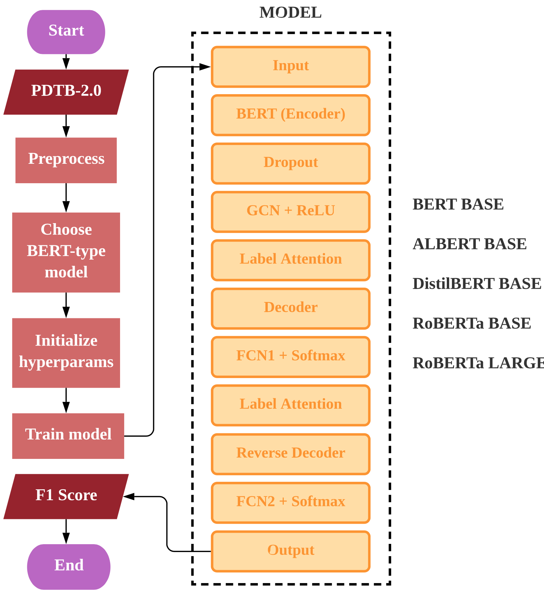
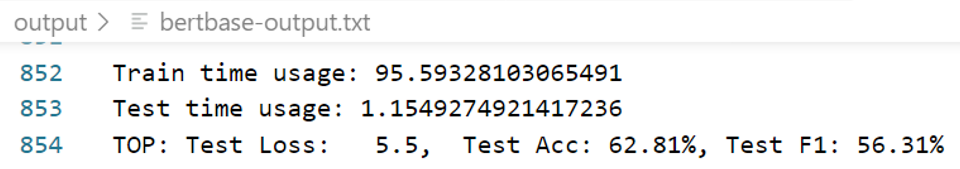
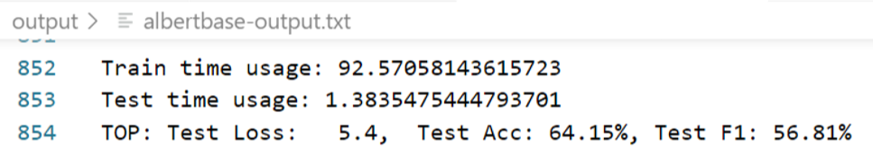
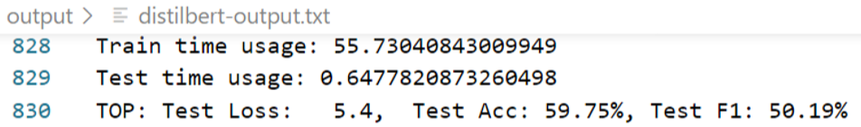
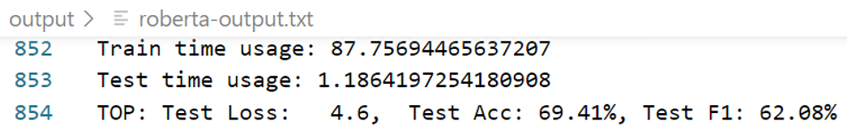
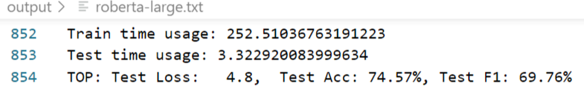

# Implicit-Discourse-Relation-Recognition

 

## Algorithm flowchart

 

## Result

| Model           | Results                                                      |
| :---------------: | :------------------------------------------------------------: |
| BERT BASE       |  |
| ALBERT BASE     |  |
| DistilBERT BASE |  |
| RoBERTa BASE    |  |
| RoBERTa LARGE   |  |

